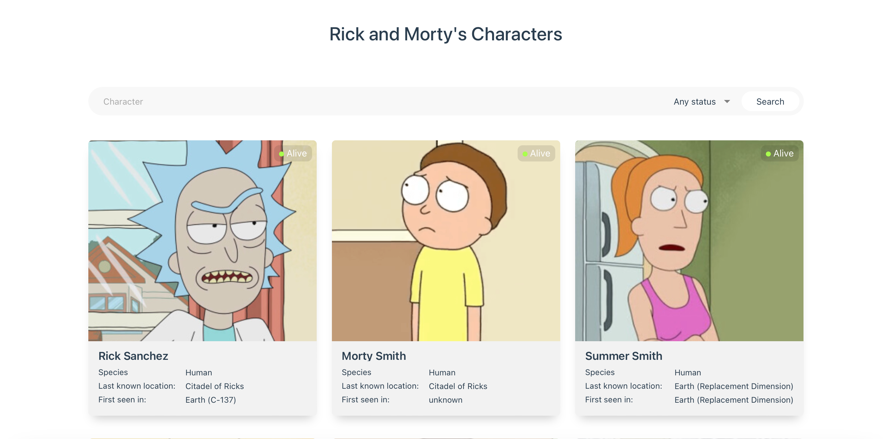
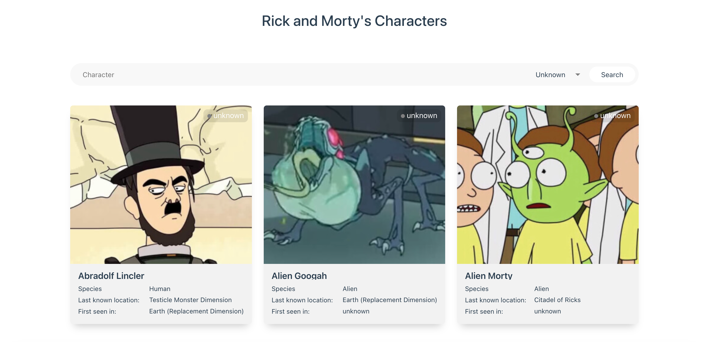
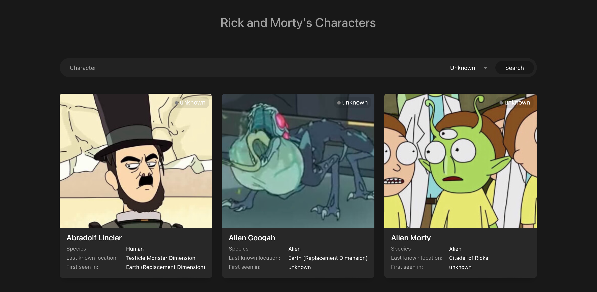

<h1 align="center">Rick and Morty's Characters on Vue</h1>

## Description

This is a web-page with Rick and Morty's characters. You can filter your search results by choosing a life status (alive, dead, unknown or any status) and you can perform a search by a keyword. The data is received from Rick and Morty API https://rickandmortyapi.com



The page supports light and dark themes





## Technologies in the project

- Vue3
- CSS
- HTML5
- Responsive Layout
- Javascript

## Project setup

```
npm install
npm run serve
```
